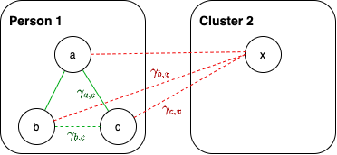
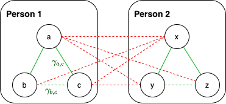

# Realistic synthetic data generation for Splink

## Rationale

We find it difficult to quantify and compare the accuracy of different approaches to record linkage.

For example:
- How do we compare different types of record linkage software?
- If we make a change to the underly algorithms in Splink, such as recent changes to term frequency adjustments, does this improve accuracy?
- How can we compare different modelling approaches - e.g. dmetaphone vs jaro, varying number of levels etc.

The main reason for this is that we lack a highly-realistic, fully labelled dataset

Clerical labelling is not a good substitute because it is very error prone.

## Aim

*Produce a fully labelled synthetic dataset of persons build entirely from open data , and thus is suitable for external publication and use*

The external dataset is valuable because it can enable different record linkage practitioners to benchmark the linkage techniques they are using.

## Challenges

Generating realistic synthetic data is challenging because of the complexity of the joint distributions.  For example, a person's name is likely to be influenced by their ethnicity and date of birth, and a person's ethnicity is likely to be related to their location (postcode).

It is critical to account for these correlations because they make seemingly-improbable events much more likely.  For example, what's the probability that we observe two different people with an unusual name who live on the same street?  How about if this street is a popular place to live amongst people who have immigrated from a particular country.  They may have names that occur extremely rarely in the UK population at large, but are common within this community.  It may even be the case that a person with this surname is likely to have one of only a small handful of first names.

A second challenge is accurately modelling the differences between records pertaining to the same person.  At a simple level, there may be a certain probability of typos.  But patterns of errors are also likely to exhibit correlations.  For example, when we comparing two records pertaining to the same person, if we observe a diference in marital status, it's more likely we'll also observe a difference in surname.

A final challenge is that we want the dataset of pairwise record comparisons to be realistic, not just the dataset of input records - see then next section.

## Pairwise comparisons

Let's say we want to generate a synthetic dataset with six records pertaining to two distinct individuals - two clusters of three:

We proceed by generating a synthetic record for each person:

Notice that, in generating these two records, we have created an implicit pairwise comparison, with comparison represented by `𝛾(a,x)`

This will be relistic only if nodes a and x are realistic draws from the distributino of all people.

Next, we generate additional records for person 1.  For these additional records to be realistic we may need to change the original record.  For example, we may have some null values, or misspellings.

Again, we need to be conscious of the of the implicit pairwise comparisons generated, shown in the following diagram.

In creating `b` and `c` we created:

- an implict pairwise comparison between `b` and `c`, shown by `𝛾(b,c)`, which match
- Implicit pairwise comparisons  between person 1 and person 2, i.e. `𝛾(b,x)` and `𝛾(c,x)`

Finally, we generate additional records for person 2, leaving us with a large number of comparisons:

## What can we learn from these diagrams?

Broadly:

    - The pairwise comparions **between different people** will only be realistic if the original records (a and x) are realistic
    - The pairwise comparison **amongst the same person** will only be realistic if the error generation process is realistic

