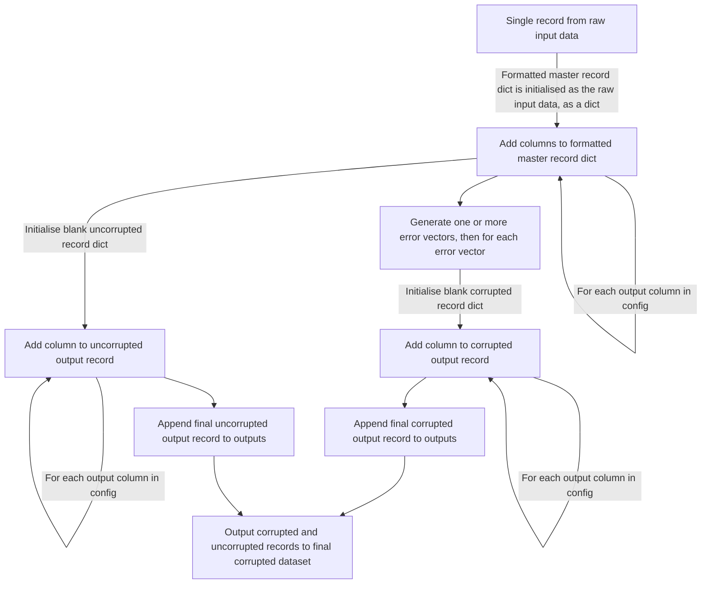

# Running these scripts

## Setup

Install poetry, which we will use for dependency management, using the insructions on their homepage [here](https://python-poetry.org/docs/#installation)

Use poetry to install the dependencies. The first line is optional but I find it useful to have the `.venv` folder in the project directory.

```
poetry config virtualenvs.in-project true
poetry install
```

In VS code, ensure the selected Python interpreter corresponds to the venv using command pallette -> "Python: Select Interpreter"

## Scraping humans from wikidata (`01_scrape_persons.py`)

Wikidata provides a query service at https://query.wikidata.org/ where we can ask for a list of humans

It is challenging to construct queries for three main reasons:

- Most columns of interest are potentially one-to-many. For example, one human can live in many countries in their lifetime, having many occupations etc
- There's far too much data to run a single query so we need a strategy to capture all data a bit at a time.
- We need to find a way of phrasing the queries so they execute quickly

We solve these issues by using a high-cardinality field (date of death), scraping each day, and then concatenating the results.

By default, the queries apply a filter so date of death is before the year 2000.

## Scraping aliases (`02_scrape_names.py`)

Wikidata provides us with a mechanism of finding aliases/nicknames/diminutives/hypocorism for common names.

This will be useful later when we wish to introduce errors variations on the original records to create our synthetic matching data.

If you get `ValueError: df does not contain 4 cols` that usually means you've scraped all the available data.

## Tidying up the scraped data (`03_raw_persons_data_to_one_line_per_person.py`)

This script simplifies the scraped data to produce a list of people with one row per person.

To handle one to many relationships, all characteristics/properties/columns are aggregated into a list.

e.g. the value of the occupation for Winston Churchill will be ['politician', 'writer'] etc.

Note that, for consistency, all fields contain lists. So Winston Churchill's date of birth is ['1984-11-30'], despite there being a single value

And where a value does not exist, the field will still contain a list with a single value `[Null]`

## Deriving alternative names lookups (`04_create_name_lookups.py`)

This creates two tables, for given and family names respectively, that have weighted aliases:

| original_name | alt_name_arr                      | alt_name_weight_arr      |
| :------------ | :-------------------------------- | :----------------------- |
| jody          | ['joseph', 'joe', 'judith', 'jo'] | [0.43, 0.23, 0.16, 0.16] |

The idea is that these could then be fed to `np.random.choice(names, p=weights)` to choose alternative names

The weights are based on the frequency of the name in the overall scraped dataset i.e. more common names will be assigned a higher weight.

## Adding additional fields useful to the corruption process (`05_transform_raw_data.py`)

## Corrupt records (`07_corrupt_records.py`)

This script takes the data in `out_data/wikidata/transformed_master_data/one_row_per_person` and created duplicate records, introducing errors of various types.

Here's an example of the raw input data - in which every value is a list of possible values:

|     | human    | dod                          | family_name   | dob                          | given_name  | country_citizen | occupation                             | humanLabel         | given_nameLabel | family_nameLabel | occupationLabel                       | country_citizenLabel | sex_or_genderLabel | place_birth | birth_country | place_birthLabel | birth_countryLabel | birth_name | humanDescription                                       | name_native_language | humanAltLabel                                                                                      | residence                                             | residenceLabel                                                          | residence_countryLabel           | pseudonym | ethnicity | ethnicityLabel | full_name_arr                                                                                                              | birth_coordinates                           | residence_coordinates                                                                                                                                                                                                                                                |
| --: | :------- | :--------------------------- | :------------ | :--------------------------- | :---------- | :-------------- | :------------------------------------- | :----------------- | :-------------- | :--------------- | :------------------------------------ | :------------------- | :----------------- | :---------- | :------------ | :--------------- | :----------------- | :--------- | :----------------------------------------------------- | :------------------- | :------------------------------------------------------------------------------------------------- | :---------------------------------------------------- | :---------------------------------------------------------------------- | :------------------------------- | :-------- | :-------- | :------------- | :------------------------------------------------------------------------------------------------------------------------- | :------------------------------------------ | :------------------------------------------------------------------------------------------------------------------------------------------------------------------------------------------------------------------------------------------------------------------- |
|   0 | Q2223137 | [datetime.date(1877, 12, 7)] | ['Q37099465'] | [datetime.date(1816, 3, 22)] | ['Q595105'] | ['Q142']        | ['Q22813352', 'Q11569986', 'Q1028181'] | ['Ernest Charton'] | ['Ernest']      | ['Charton']      | ['traveler', 'printmaker', 'painter'] | ['France']           | ['male']           | ['Q456']    | ['Q142']      | ['Lyon']         | ['France']         | []         | ['French painter active in South America (1816-1877)'] | []                   | ['e. charton, Ernest Charton de Treville, Ernest Marc Jules Charton de Treville, Ernesto Charton'] | ['Q90', 'Q456', 'Q1486', 'Q2887', 'Q33986', 'Q42810'] | ['Paris', 'Lyon', 'Buenos Aires', 'Santiago', 'Valparaíso', 'Le Havre'] | ['France', 'Argentina', 'Chile'] | []        | []        | []             | ['Ernesto Charton', 'Ernest Marc Jules Charton de Treville', 'Ernest Charton de Treville', 'e. charton', 'Ernest Charton'] | [{'lat': 45.758888888, 'lng': 4.841388888}] | [{'lat': 48.856944444, 'lng': 2.351388888}, {'lat': 45.758888888, 'lng': 4.841388888}, {'lat': -34.599722222, 'lng': -58.381944444}, {'lat': -33.45, 'lng': -70.666666666}, {'lat': -33.046111111, 'lng': -71.619722222}, {'lat': 49.494166666, 'lng': 0.108055555}] |

This data is then converted into:

- A single uncorrupted output record
- One or more corrupted output records

using the following process:



The script uses a config, which specifies, _**for each output column**_:

- `format_master_data`: Any transforms to apply to the raw input data to clean it up and make it easier to process. For example, some arrays like date of birth should only have one element, so we might want to take the first element.
- `gen_uncorrupted_record`: How to turn the formatted master data into an uncorrupted output record
- `corruption_functions`: A list of functions that apply corruptions of various types to the `formatted_master_data`
- `null_function`: A function that describes how to null out (partially or completely) the output record

The config is a list of dictionaries. An example of an element, which produces an output occupation column could look like this:

```
    {
        "col_name": "occupation",
        "format_master_data": occupation_format_master_record,
        "gen_uncorrupted_record": occupation_gen_uncorrupted_record,
        "corruption_functions": [{"fn": occupation_corrupt, "p": 1.0}],
        "null_function": basic_null_fn("occupation"),

    },
```

This example will be used below to provide more detail how it works.

For each item in the config

- Apply the function provided at `format_master_data` and apply the function provided `format_master_data()`. This is sometimes needed to further prepare input data into something easy to corrupt. In our example, the function `occupation_format_master_record` is called.

- Create an uncorrupted output record using the function provided at `gen_uncorrupted_record`, in our case `occupation_gen_uncorrupted_record`. Another good example is if we want to pick the 'best' name for a person out of a series of alternatives.

- Create a series of corrupted records, using one or more corruption functions provided at the key `corruption_functions` and the `null_function`.
